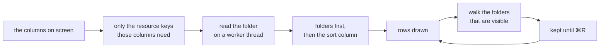
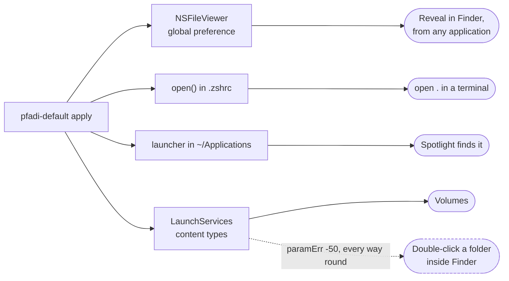
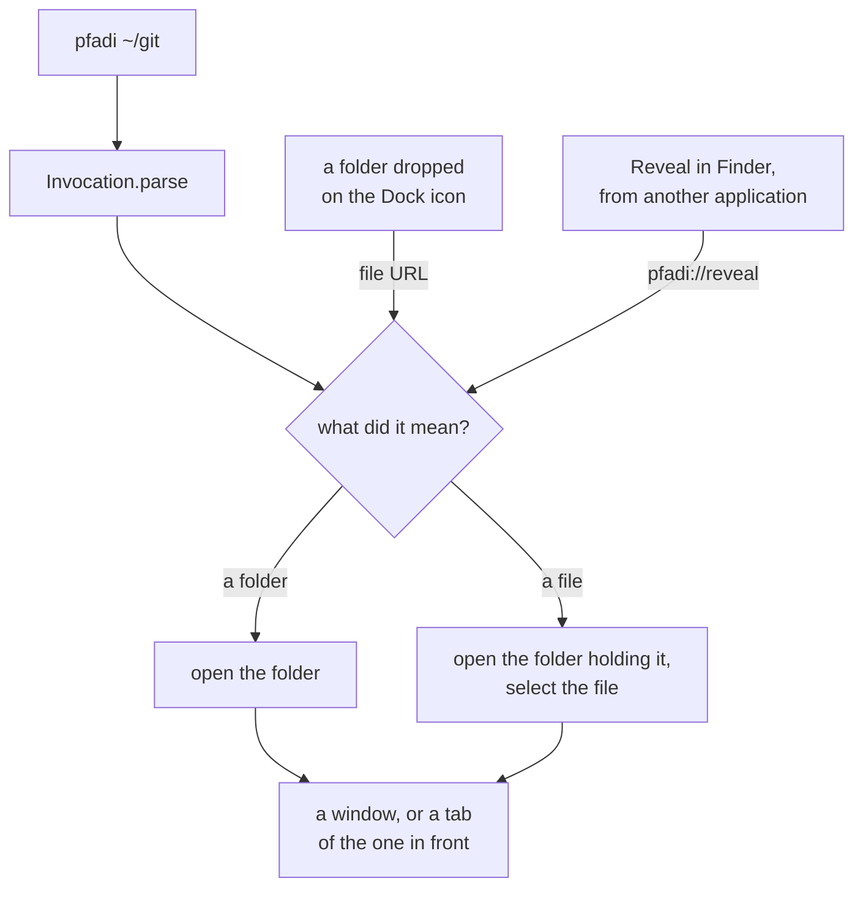

# pfadi


A small macOS file browser with the one thing macOS has never had: an address
bar you can click into and type, with tab completion.

It browses, copies, moves, renames, trashes and makes folders, in tabs, with
drag and drop, several files at a time, and ⌘Z takes back any of it. Reveal in
Finder from every other application can be pointed at it.

It is not signed or notarised, which is why the Homebrew formula compiles on
your machine rather than downloading a binary. Finder stays for the two things
macOS will not hand over, and [Instead of Finder](#instead-of-finder) says
exactly which two, why, and what was measured to find out.

```bash
brew install sapn95/tap/pfadi
pfadi-default apply
```

## The problem

Finder gives you three ways to see where you are and none to say where you want
to go.

| What it offers | What it does not |
| --- | --- |
| A path bar at the bottom | Read-only. Double-click a segment to jump, but you cannot type in it. |
| A path menu behind ⌘-clicking the window title | A menu of ancestors. No input, no completion. |
| Go to Folder, ⇧⌘G | A modal sheet on top of the window. A detour, not an address bar. |

Every third-party file manager that does have a typable address bar is either
paid ([QSpace], [Path Finder], Commander One), dual-pane by conviction
([Nimble Commander]), or not written for macOS at all.

So: one pane, one path field, keyboard first.

## Keys

```text
⇧⌘G      type a path, with tab completion
click    a folder in the path: everything beside it, with a filter
2×click  a folder in the path: go there
›        the arrow after the last folder: everything inside it
⌘F       filter the folder you are in
space    Quick Look, and again to close it
return   open, or go there
⇧↑ ⇧↓    extend the selection
⌘click   add one row to it, or take one out
⇧click   everything between here and there
a-z      type-ahead: jump to the row whose name starts like that
⌘[ ⌘]    back and forward
⌘↑       enclosing folder
⌘↓       open the selected folder in a tab
⇧⌘H      home
⇧⌘.      hide the dotfiles, which are shown by default
⇧⌘K      the Created column, on and off
right-click the column headers: which columns to show
drag     a column header to move it
⌘R       refresh
⌘T ⌘N    a new tab, a new window
⌘C ⌘V    copy, then paste, with ⌥⌘V to move instead
⇧⌘N      new folder, with the cursor already in its name
F2       rename
⌘⌫       move to the trash
⌘Z       undo any of that
⌘I       what is this: kind, size, dates, access, cloud status
⇧⌘C      copy the path of the selection
⌃⌘T      open a terminal here
⇧⌘R      show it in Finder, the real one
⌘D       add this folder to the sidebar, or take it back out
⌘K       connect to a server
```

## The address bar

The path along the top is clickable, all the way to the root: a path that
quietly begins in the middle is one you have to think about before you can
trust it. Clicking a folder offers everything beside it; the arrow after the
last one offers everything inside it. Both menus have the same shape, with the
filter at the top and already focused, whichever part was clicked and however
few folders are in it. A menu that is sometimes a plain list and sometimes a
searchable one means looking first and reacting second, every single time.

A **double click** on a folder in the bar goes straight there without the menu.
That needs the menu to wait for the system's double-click interval before it
opens: a menu takes over event tracking the moment it appears, so one opened on
the first click swallows the second, and the double click could never happen
however it was written.

Clicking the leftmost folder goes straight there, because the root has no
siblings to offer. When the path is too long, folders fold into an ellipsis
that still opens them, and they give way in a deliberate order: the ones just
below the root first, then the root, and never the last one.

The menu opens the moment you click, and a double click on a folder goes
straight there. Those two are harder to have together than they look: a menu
takes over event tracking the instant it appears, so the second click lands
inside it and nothing can see it coming. Waiting for the system's double-click
interval before opening would show it — and that interval is half a second,
which is far too long for the gesture people actually use. So the double click
is caught on the way out instead: `popUp` blocks until the menu closes, and what
closed it can then be asked.

`⇧⌘G` or the button at the right end of the row swaps the whole thing for a
text field. Tab walks the matches inline, shift-tab goes back, both wrap, and
the status line counts along: `2 of 7`.

Escape does one of two things, and which one depends on whether tab has been
pressed. Part way through walking the matches it puts back exactly what you
typed before the first tab and leaves you in the field. Otherwise it gives up
on the field altogether: the path goes back to where you actually are and the
clickable bar returns.

Return has two jobs, in the order you need them. The first accepts the match
showing and leaves you in the field, so the next tab carries straight on into
the folder you just chose. The second goes there.

A path can be absolute, relative, or start with `~`. Pointing it at a file
hands the file to whichever application owns it.

## The sidebar

**Favourites** are yours: ⌘D adds and removes, a folder dropped between two
becomes one at that position, dragging reorders, and right-click removes. It
starts with Home, Desktop, Documents, Downloads, Applications and the root,
because a file browser that cannot reach `/` is a browser for one folder tree.

**Recents** is the last ten folders, newest first, with home left out: that is
where a window opens when nothing else is known, not somewhere you chose.

**Cloud** and **Locations** are facts about the machine rather than a list
somebody curates, so they cannot be edited. Cloud is whatever is in
`~/Library/CloudStorage` — your OneDrive, Dropbox or Google Drive accounts,
which otherwise live inside a folder macOS hides and are unreachable unless you
already know the path. Locations is the mounted volumes. Both are looked for
again when the window comes forward rather than on every navigation: asking the
kernel for every mounted filesystem blocks on a share whose server has gone
away, and that belongs nowhere near walking a folder tree.

**Servers** remembers what you have connected to, and always ends in
`Connect to Server…`. A way in that only appears once you already have one is
not a way in.

## Cloud files

OneDrive, Dropbox, Google Drive and iCloud all leave **placeholder** files: a
name, a size, a date, and no bytes. They look completely ordinary to a
directory listing, which is how copying "everything" quietly pulls a hundred
gigabytes down a metered connection.

A placeholder shows a cloud in the size column, the status line counts them,
and ⌘I says which provider, which account, and how much of the file is actually
on this Mac.

The check is `lstat` against the dataless flag plus the path. **Deliberately
not the File Provider**: asking an extension about an item is how you start
downloading the thing you were only trying to describe. The provider is
resolved once per folder, so a folder outside anybody's cloud costs nothing per
file.

Downloading a placeholder on demand and evicting one to free space are not
here: both need the File Provider domain APIs rather than a filesystem call.
Opening a file downloads it, because that is what the provider does when
something reads it.

## Shares

Type `smb://server/share` or `nfs://filer/export` into the path field and it
mounts and opens. `⌘K` asks instead, with the protocol as a button and the
shape each one expects written under the field.

It understands what people actually paste:

| Pasted | Understood as |
| --- | --- |
| `\\filer\projects` | `smb://filer/projects` |
| `\\filer\team share\docs` | `smb://filer/team%20share/docs` |
| `filer:/export/data` | `nfs://filer/export/data` |

It says when it rewrote something, quoting both back, and a checkbox turns that
off. An already-mounted share is found rather than mounted again, which is how
people end up with `share-1` through `share-4`.

## Several at once

⇧↑ and ⇧↓ extend the selection, ⌘-click adds and removes one, shift-click takes
everything between. Every action then acts on all of it: copy, move to the
trash, copy the paths, reveal in Finder, drag out, drop in. Quick Look walks
the selection with its own arrows, and the status line counts what is picked
and adds up the file sizes.

Two stay singular on purpose. **Rename** works on one row, because there is one
field editor and one name being typed into it. **Get Info** describes one thing,
because a panel about five files at once is a different panel.

Opening several is the one place it has to choose. One folder is walked into,
because that is what a browser is for; several are opened as tabs, because
there is nowhere else for them to go; files are handed to whatever owns them.

A selection survives a reload. The watcher fires whenever anything in the
folder is written, and losing five picked rows because a build wrote a log file
is the kind of thing that makes a list feel hostile.

## Folder sizes

The size column shows a real number for folders, measured by walking them,
because the filesystem does not record one. Two rules keep that from costing
anything:

- **Only what is on screen.** Scrolling asks for the rows now visible and tells
  the walk in flight to stop if it is no longer one of them.
- **Only once.** Answers are kept, so scrolling back is instant. ⌘R is the one
  thing that throws them away, because re-walking a tree every time the watcher
  fires would make the column cost far more than it is worth.

An en dash means not measured yet. `over 4.2 GB` means the walk hit its limit
and the number is a floor rather than a total — a guess dressed as an answer is
worse than an honest bound.



**Sorting by size sorts the folders too**, which is the reason to measure them
at all. Clicking that header measures every folder in the listing rather than
only the visible ones, because an order worked out from whatever happened to be
on screen is not an order. Rows settle as the answers arrive, and a folder not
measured yet sits at the bottom of the folder block either way up: unknown is
not zero, and treating it as zero would put it on top of a smallest-first list
and then move it.

## Columns

Twelve of them. Three are on to begin with.

| Column | |
| --- | --- |
| **Name** | Cannot be switched off. |
| **Size** | Files from the filesystem, folders by walking them. |
| **Files** | How many are inside, from that same walk, so it costs nothing extra. |
| **Modified** | |
| **Created** | Blank where the volume records none, which an SMB share often does not. |
| **Added** | When it arrived in this folder. In `~/Downloads` it is the only date that means anything. |
| **Last Opened** | |
| **Kind** | What the system calls it: Folder, PNG image, Terminal script. |
| **Extension** | |
| **Tags** | Finder's, in Finder's order. |
| **Permissions** | `drwxr-xr-x`. Finder cannot show this in a list at all. |
| **Owner** | |

**Right-click the headers** for the list, with a tick against the ones showing.
It is also under **View → Columns**, because a menu you have to know to
right-click for is a menu most people never find. **Drag a header** to move a
column. ⇧⌘K is the shortcut for Created.

Name cannot be hidden, and pfadi says so in the banner rather than greying the
item out with no explanation: a list of sizes and dates with nothing saying
which file they belong to is not a list.

**Only what is on screen is read off the disk.** Tags, owner and permissions
each cost something per entry, and a folder of forty thousand files should not
pay for a column nobody switched on. Switching one on re-reads the folder;
switching one off is a redraw.

Two details that would otherwise bite. **Permissions and Owner come from
`lstat`**, not from the resource keys, because those follow symbolic links and
the interesting thing about a link is the link — a link shows as `l...` here.
And **the column being sorted by is read even when it is hidden**, or a sort
restored from last launch would name a column since switched off and leave the
list in an order with nothing on screen to explain it.

Every header sorts except Files, whose number arrives after the listing does;
sorting by it would put the rows in an order and then change it under the
pointer. Hiding the column being sorted by falls back to name. Widths, order and
the sort all survive a quit.

## Writing to disk

Everything that changes anything is reversible. ⌘Z puts back a trashed file,
undoes a rename, trashes a folder that was just created, and unwinds a copy or
a move.

Anything that did not happen gets a **band across the top of the list**, not
just a line in the status bar. The status bar is eleven points of secondary grey
and it is the right place for how many items there are; it is the wrong place
for "that did not happen", which read from where anybody is actually looking as
nothing happening at all. The band stays until it is dismissed or until you go
somewhere else.

**Some things will not go to the trash, and now they say so.** `~/Documents`,
`~/Desktop`, `~/Library` and the rest of the folders macOS keeps inside a home
directory cannot be trashed — and the refusal is not an error. `trashItem`
returns without throwing, reports where the item supposedly landed, and leaves
the folder exactly where it was. So every trash is checked afterwards rather
than believed, and a selection that mixes the possible with the impossible does
what it can and reports the rest:

```text
moved report.pdf to the trash; could not move Documents:
macOS does not let this folder be moved to the trash
```

**Replacing never destroys.** Choosing Replace during a paste puts the existing
item in the trash first and then copies. A wrong answer in that dialog is
recoverable, which is not true of a file manager that overwrites in place.

Copies go through `copyfile` with `COPYFILE_CLONE`. On APFS that is a
constant-time copy sharing blocks until one side is written to, so duplicating
twenty gigabytes costs no time and no disk, and it carries the extended
attributes, ACLs and flags a read-and-write copy silently drops. A move within
one volume is `rename(2)`; across volumes it falls back to copy and delete, and
takes the emptied source folders with it.

The tree is expanded before anything starts, so the progress bar is honest and
Stop lands between two files rather than inside a recursive call. Conflicts are
all resolved up front: being interrupted halfway through a long copy, with no
idea what has already happened, is what makes people stop trusting a file
manager.

Two things it refuses outright: a folder into itself, and a folder into its own
descendant. The containment check compares path components rather than string
prefixes, or `/a/bc` would count as living inside `/a/b`.

## Instead of Finder

```bash
pfadi-default          # what the system has now, changing nothing
pfadi-default apply    # the file viewer, the launcher, the shell function
pfadi-default undo     # all of it back
man pfadi-default      # the long version
```

Every claim it makes is measured at run time rather than assumed, and the
answers are not all the same.



**What works, and it is the big one.** `NSFileViewer` is a global preference
that decides what "Finder" means to AppKit. `selectFile:inFileViewerRootedAtPath:`
— the call behind **Reveal in Finder**, **Show in Finder** and **Show in
Enclosing Folder** in every other application — reads it, and hands the file to
whatever it names. Set it, and "show me where this is" from your browser, your
editor or your mail client opens pfadi with the file selected. It has been
undocumented since Mac OS X 10.4 and it is the same mechanism Path Finder and
ForkLift use.

**What does not.** Double-clicking a folder inside Finder.

| | |
| --- | --- |
| Reveal in Finder, from anywhere | **Handed over**, via `NSFileViewer` |
| Volumes | Handed over |
| Folders | **Blocked** |
| Directories | **Blocked** |
| The `file://` scheme | **Blocked** |

Blocked by macOS itself, not by a missing declaration, and asked through the
interface that is current rather than the one that is deprecated:

| Asked how | Answer for `public.folder` |
| --- | --- |
| `NSWorkspace.setDefaultApplication(at:toOpen:)`, macOS 12+ | `NSCocoaErrorDomain 256`, wrapping `NSOSStatusErrorDomain -50` |
| `LSSetDefaultRoleHandlerForContentType`, deprecated | `paramErr` (-50) |
| the same, with `LSHandlerRank: Owner` instead of `Alternate` | `paramErr` (-50) |
| writing the handler into `com.apple.launchservices.secure` | written, then ignored |
| `lsregister -dump` | pfadi **is** a registered claimant, and is refused anyway |

`apply` uses the modern call, because a refusal from a deprecated function is a
weaker claim than a refusal from the current one. It is the same refusal. It
also writes the preference-file entry, reads back what LaunchServices actually
reports, and says so when the two disagree rather than claiming a win.

The command every forum post recommends for this no longer exists:

```console
$ lsregister -kill -r -domain user
The -kill option has been removed because it was dangerous and no longer useful.
```

On a Linux desktop this is one line — `xdg-mime default pfadi.desktop
inode/directory` — which is worth knowing, because it means the wall here is a
decision rather than a missing feature.

Finder cannot be taken out of the Dock either, and not for want of a
preference: it is not in `persistent-apps` at all, because Dock.app draws it.
Removing it means turning off System Integrity Protection and FileVault and
editing the sealed system volume. That is a bad trade for an icon.

Of everything else that claims to replace Finder, only QSpace goes further, and
it does it by **not being Finder's desktop**: it draws its own, so a
double-click on a folder there never reaches Finder in the first place. ForkLift
and Path Finder use `NSFileViewer` and the same preference-file entry, and ask
for a restart that pfadi does not need. That route is in
[Wanted next](#wanted-next), with what it would cost.

So the shell function `apply` installs remains: it sends `open .` and
`open <folder>` to pfadi and leaves `open report.pdf` alone, because it only
takes over when there is exactly one argument and it is a folder.

The launcher it puts in `~/Applications` is a bundle whose only content is the
command that starts pfadi. A symlink there is not indexed, because Spotlight
indexes `~/Applications` but not Homebrew's Cellar. A copy is indexed and then
goes stale the next time brew upgrades the real thing, which is worse: it keeps
launching a version that is no longer installed. A launcher is neither.

`undo` gives everything back, and only what is ours: the launcher goes only if
its bundle identifier says pfadi wrote it, `NSFileViewer` is cleared only if it
still names pfadi, and the shell block is cut out from between its markers so
the rest of the profile survives byte for byte.

## Show in Finder

Once pfadi is the system's file viewer, the polite call for this —
`activateFileViewerSelecting` — comes straight back to pfadi. A menu item inside
pfadi that opens pfadi is a command that does nothing and looks like a bug, so
**Show in Finder addresses Finder by name** when pfadi holds `NSFileViewer`, and
uses the polite call when it does not.

The cost is that the item is not selected, only its folder opened. `open -R`
goes through the same preference and is hijacked too; the only route left that
selects is an Apple Event, which would put a "pfadi wants to control Finder"
permission prompt behind a menu item. Getting to Finder at the right folder is
what somebody asked for. A dialog is not.

## The command

```bash
pfadi                     # the folder the shell is in
pfadi ~/git ~/Downloads   # two folders, as tabs of one window
pfadi -R ./report.pdf     # point at a file rather than opening it
pfadi --help              # and it is pfadi that answers
man pfadi
```

This used to be two lines of shell handing `$1` to `/usr/bin/open`. It was
right about one thing and wrong about the rest: running the binary directly
holds the terminal until the window closes, whereas going through
LaunchServices returns at once and reuses a window that is already open. So
that stayed. What went were `pfadi --help` printing the usage of `open`,
`pfadi a b` opening `a` and dropping `b` without a word, and a missing path
reporting "The file … does not exist" about a folder.

`-R` needs its own flag because a file URL cannot say "select this" — a folder
handed over is one you want opened. So a reveal travels as `pfadi://reveal`
instead, which is also what an incoming Reveal in Finder arrives as.



## Build

Needs Swift 6 and macOS 14. The Command Line Tools are enough; Xcode is not
required, which is the whole reason the test target looks the way it does.

```bash
swift build                     # the binary
swift run pfadi-selftest        # the tests
swift run pfadi --layout-check  # the window, clicked through
./scripts/coverage.sh           # how much of PfadiCore that ran, with a floor
./scripts/check-diagrams.sh     # every diagram in this README still renders
./scripts/make-app.sh           # build/Pfadi.app
```

The diagrams above are ```` ```mermaid ```` blocks rather than committed SVGs,
because GitHub renders them itself and a second copy of a picture is a second
copy to keep in step. What a committed SVG would have proved — that the source
parses — `check-diagrams.sh` proves instead, by handing every block to the real
renderer and throwing the output away.

Coverage is measured on PfadiCore and CI fails below 80%. Not on the AppKit
half: that is what `--layout-check` is for, and a single number covering both
would hide whichever one was slipping. `swift test --enable-code-coverage`
cannot be used because the tests are a plain executable, so the instrumentation
is asked for directly and the profile merged by hand, which is all `swift test`
does anyway.

There is no Developer ID signature and no notarisation, and that is a decision
rather than an omission. A certificate needs an Apple Developer Program
membership at 99 USD a year and there is no free route to one. What it would
buy is handing somebody a prebuilt `.app` that opens on a double click, and
nothing else: the formula compiles on the machine it will run on, and a locally
built binary is never quarantined. `scripts/sign-and-notarise.sh` and the
`sign` job stay, and turn a certificate into a signed release the day one
exists.

Releases are cut by tagging. `VERSION` is the single source of truth and the
release workflow refuses a tag that disagrees with it.

It can also be run for a tag that already exists, from the Actions tab. A tag
push is a webhook, and GitHub throttles webhooks when Actions is having a bad
day: on 6 August 2026 a pushed tag produced no run at all and three releases
had to be cut by hand. One trigger is not enough for the one workflow that has
to happen.

## How it is put together

| Path | What lives there |
| --- | --- |
| `Sources/PfadiCore` | Listing, sorting, completion, type-ahead, the watcher, transfers, favourites, preferences, shares. No AppKit, so it can be tested. |
| `Sources/pfadi` | The window, the list, the path bar, the sidebar, the menus. AppKit, built in code, no nib files. |
| `Sources/pfadi-cli` | The `pfadi` command. Parses the arguments, then hands them to LaunchServices. |
| `scripts/coverage.sh` | Coverage on PfadiCore, with the floor CI enforces. |
| `Sources/pfadi-default` | The tool that puts pfadi where Finder is. |
| `man/` | The manual pages, checked against `--help` by the tests. |
| `Tests/PfadiSelfTest` | The tests, as a plain executable. |
| `scripts/` | The `.app` bundle, the icon, signing. |
| `Formula/pfadi.rb` | The Homebrew formula, copied into the tap on release. |

Four decisions a reader trips over.

**The tests are an executable, not a `.testTarget`.** XCTest and swift-testing
both ship inside the full Xcode install, so `swift test` cannot run on a machine
with only the Command Line Tools. A 15 GB download is a steep price for three
hundred assertions.

**There is a window check.** A layout mistake is invisible to a build, to the
tests and to a launch: the application starts, and the window is sixty points
tall with the filter off the edge. `--layout-check` builds the real window
off-screen at two sizes, measures every control, and fails on an **ambiguous**
layout, because a view free to be in two places will eventually pick the wrong
one.

It then clicks through it. The root was unreachable for three versions while
the model that knew about it was correct the whole time, so reading the model
proved nothing. These go through the same code a click runs: the path bar's own
button action, the sidebar's own selection handler. They also wait for the
listing, because reading a folder happens on a worker and arrives on the main
queue, and a check with no run loop turning sees an empty folder every time.

**The path bar is buttons, not `NSPathControl`.** That control reports the same
intrinsic width whatever it shows, sixty points for one folder or for ten, so
nothing beside it can be placed relative to its contents and the whole row ends
up underdetermined.

**Directory URLs go through one funnel.** Foundation appends a trailing slash
when it has consulted the filesystem and none when it has not, so the same
folder produces two URLs that compare unequal. `PathCompletion.directoryURL` is
the single spelling, and it took three separate bugs to learn that.

## CI

Every pull request runs, on the newest published version of each action:

| Job | What it proves |
| --- | --- |
| build and self-test | `swift build`, the suite, the layout check, and that `make-app.sh` produces a launchable bundle |
| swift-format | `swift format lint --strict` |
| lint workflows | actionlint, yamllint, markdownlint |
| secret scan | gitleaks over the full history |

The build job runs on macOS because AppKit does not cross-compile. The rest run
on Linux because they do not need to.

## Wanted next

- **Expandable folders in the list**, the way an open panel does it.
- **Renaming several at once**, which needs a dialog rather than a field editor.
- **Its own desktop**, which is the only remaining way to make a double-click on
  a folder land here. It means `CreateDesktop false` and taking over icon
  layout, drag and drop, the context menu and Stacks, and it would still only
  cover the desktop. QSpace is the one competitor that does it.
- **Downloading and evicting cloud placeholders**, which needs the File
  Provider domain APIs.

## Licence

MIT, see [LICENSE](LICENSE).

[QSpace]: https://qspace.awehunt.com
[Path Finder]: https://cocoatech.io
[Nimble Commander]: https://magnumbytes.com
