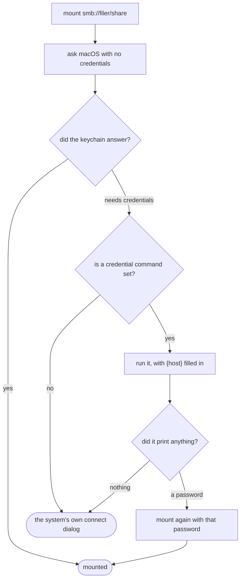

# Passwords for shares

pfadi can ask a password manager for a share's password instead of putting a
dialog in front of you. This page is how.

It is worth saying at the top what this is **not**: there is no Proton Pass
integration in pfadi, and there will not be one. pfadi runs a command you
configure and reads one line from it. Proton Pass is one of the things that can
answer; so are 1Password, `pass`, Bitwarden, and a shell script you write
yourself. Naming one of them in the code would make pfadi depend on a company.

It is the same shape [`git config credential.helper`][git-helper] has, for the
same reason.

[git-helper]: https://git-scm.com/docs/gitcredentials

## macOS answers first, and usually that is the end of it

Before any of this runs, pfadi asks the system to mount the share with no
credentials at all. `NetFSMountURLSync` reads your keychain itself, so a share
Finder has ever connected to mounts with **no prompt and no command**.



So the command is reached only when the system says it needs credentials.
Running your password manager for a share that needed no password would be a
prompt nobody asked for.

**Printing nothing is a normal answer.** A manager with no entry for this host
has answered the question, and pfadi hands the share to the system's dialog
rather than reporting an error.

## Setting it

```bash
pfadi-default credentials 'some-command --for {host}'
pfadi-default credentials            # what is set now
pfadi-default credentials off        # back to the dialog
```

These are substituted, one argument at a time:

| | |
| --- | --- |
| `{host}` | `filer97.sbb.ch` |
| `{share}` | `projects` |
| `{user}` | from the address, or from whatever asked |
| `{scheme}` | `smb`, `nfs`, `afp` |
| `{url}` | the whole address |

## Proton Pass

Proton has had an official CLI since November 2025. It is the only programmatic
route into a Proton Pass vault — there is no public API and no autofill
extension a third-party macOS application can use.

**It needs a paid plan.** Pass Plus, Pass Family, Pass Professional or any
Proton bundle; the free plan cannot use the CLI.

```bash
brew install proton-pass-cli
pass-cli login                       # opens a browser
pass-cli info                        # confirms there is a session
```

Then make an item whose **title is the hostname**, so `{host}` finds it:

```text
Vault:  Filers
Title:  filer97.sbb.ch
Field:  password
```

Check it by hand before pointing pfadi at it:

```bash
pass-cli item view --vault-name Filers --item-title filer97.sbb.ch --field password
```

That prints the password and nothing else — no label, no trailing blank line,
no colour. Verified against pass-cli 2.2.5 with a throwaway item: twenty
characters in, the same twenty characters out.

Then:

```bash
pfadi-default credentials \
  'pass-cli item view --vault-name Filers --item-title {host} --field password'
```

For a headless machine, or one where a browser login is not possible, Proton
supports personal access tokens with `pass-cli personal-access-token`. That is
not needed for a Mac you sit in front of.

Two things worth knowing before you rely on it:

- **The trash is not deletion.** An item moved to the trash still answers
  `item view` with its password. To make an entry stop answering, delete it:
  `pass-cli item delete --share-id … --item-id …`, which takes identifiers
  rather than titles. Found by doing it.
- **The session is on this machine, not in the command.** `pass-cli info` says
  whether there is one. If it has expired, pfadi reports
  `exited 1: This operation requires an authenticated client` and falls through
  to the system dialog, which is the right thing but is not obviously a login
  problem until you read it.

## The others

These follow each tool's own documentation. The mechanism is the same for all
of them: print the password on standard output, print nothing to decline.

**1Password**, with the [`op` CLI][op]:

```bash
pfadi-default credentials 'op read op://Private/{host}/password'
```

**`pass`**, the standard Unix password manager. `pass show` prints the first
line of the file, which is the password by convention:

```bash
pfadi-default credentials 'pass show filers/{host}'
```

**Bitwarden**, with the [`bw` CLI][bw]. It needs `BW_SESSION` in the
environment, which means this one wants a wrapper script — see below:

```bash
bw get password {host}
```

**KeePassXC** can do it with `keepassxc-cli show -a Password`, but it wants the
database password on standard input, which pfadi closes. Wrap it.

[op]: https://developer.1password.com/docs/cli/
[bw]: https://bitwarden.com/help/cli/

## When you need more than one command

The command is **not a shell**. There are no pipes, no variables, no `$(…)`,
no globbing. Quoting is honoured so a vault called `"Work Filers"` survives as
one argument, and that is all.

That is deliberate — see below — and it means anything cleverer goes in a
script that you point pfadi at:

```bash
#!/bin/sh
# ~/bin/share-password — one place to put whatever it takes.
set -eu
export BW_SESSION="$(cat ~/.config/bw-session)"
exec bw get password "$1"
```

```bash
chmod +x ~/bin/share-password
pfadi-default credentials '~/bin/share-password {host}'
```

A script is also where to put a fallback across two managers, a lookup by
something other than the hostname, or a `case` over `{scheme}`.

## Why it works the way it does

Three decisions, each of which has a test that fails without it.

**It is argv, never a shell line.** A hostname arrives off the network. A share
on a host called `filer; rm -rf ~` is a hostname, and with `execve` there is no
parser between pfadi and the program that could decide otherwise. Substitution
happens per argument, so a value containing spaces can never become two
arguments.

**What the command prints on standard output is the password, and it reaches
nothing else.** Not the status line, not an error message, not a log. If the
command also echoes it on standard error — some do, when they fail — that line
is replaced with a note rather than shown.

**It is given thirty seconds and then killed.** A password manager may want
Touch ID, which is human-speed, but a command that hangs must not hold the
mount open behind it. The first version of this read the command's output
before waiting, which blocks until the command exits, so the timeout was
unreachable and `sleep 30` slept for thirty seconds under a one-second limit.
A test found that, not a person.

## Checking it yourself

The self-test can run the whole path against your own manager, which is the one
thing its other checks cannot cover — that a real tool's output is the shape
this code expects:

```bash
PFADI_CREDENTIAL_CHECK='pass-cli item view --vault-name Filers --item-title {host} --field password' \
PFADI_CREDENTIAL_HOST='filer97.sbb.ch' \
  swift run pfadi-selftest
```

```text
credentials: a real password manager answers
  ok   it answered with 20 characters
  ok   on one line, which is what the mount is handed
```

It reports the length, never the password. Without those two variables it is
skipped, because a check cannot assume anybody has a manager installed, let
alone logged in.

## When it does not work

`pfadi-default credentials` with no argument prints what is set. Then run that
command by hand with a real hostname in place of `{host}` — nearly every
problem is visible there and not in pfadi.

| What pfadi says | What it means |
| --- | --- |
| `exited 1: …` | The command ran and failed. Its first line of standard error is quoted |
| `did not answer within 30 seconds` | It hung. A manager waiting for an unlock nobody is looking at, usually |
| `could not run …` | No such program. Use an absolute path if it is not on `PATH` |
| `the password it gave was not accepted` | It answered and the server said no |
| nothing, and the system dialog appears | It printed nothing, which is how a manager says it has no entry for this host |

pfadi runs the command with no terminal and nothing on standard input, so
anything that wants to ask a question interactively will hang rather than ask.
That is what the wrapper script above is for.
